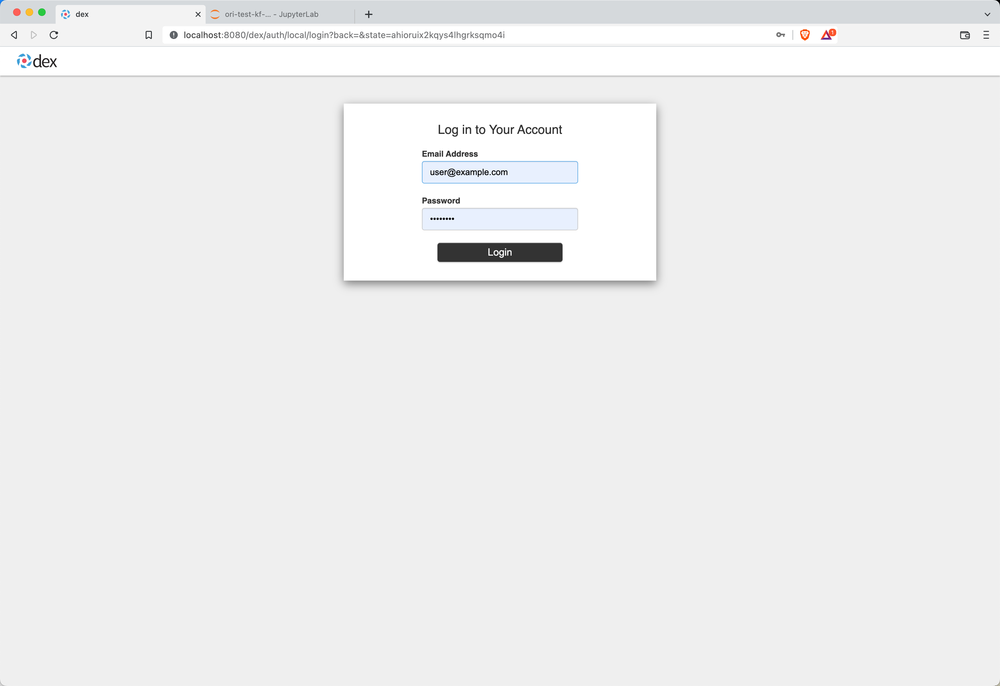
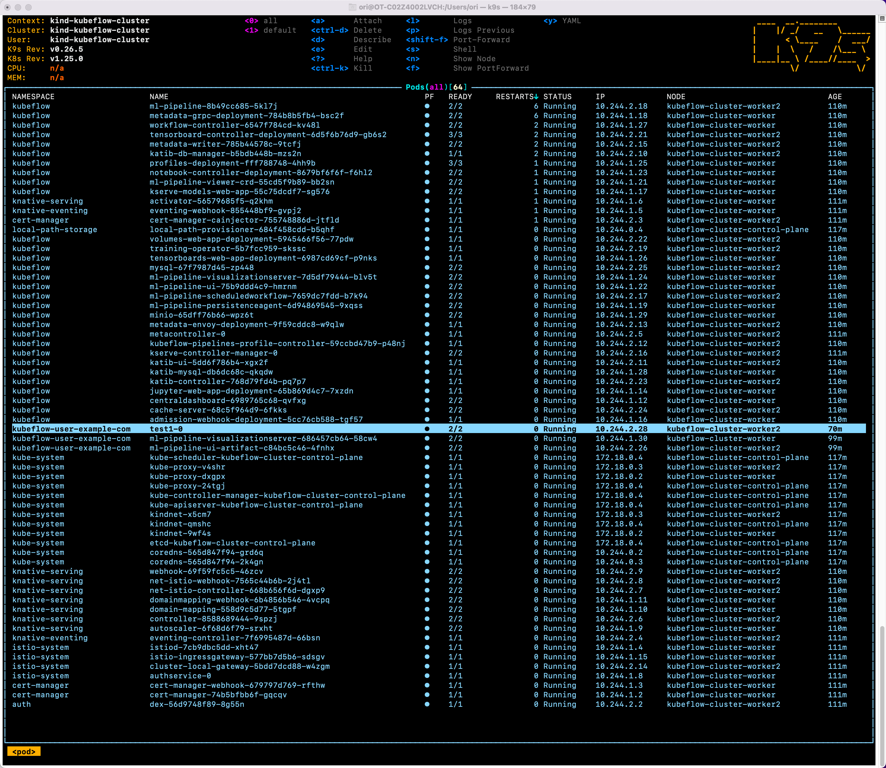
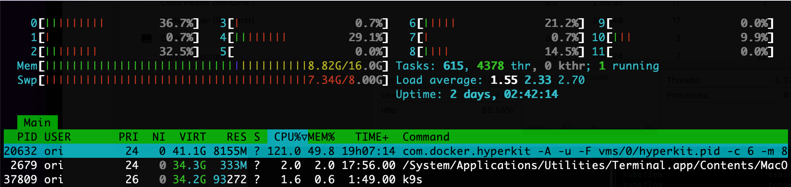

# Kubeflow POC

## Objective 

run `Kubeflow` locally on macOS in a `kind` cluster of 3 nodes. 

## Research Notes
old README, renamed [Research](./Research.md)

## Installation 
Prerequisites, Docker Desktop setup etc are detailed in _Research_. 

The script below does all the rest.  
- After it says _Finished_, it may take well over 15 minutes for the cluster to become operational

~~~
./create.sh
~~~

## Credentials
login to the dashboard

username: `user@example.com`  
password: `12341234`

## 60+ Pods 
A huge number of pods is invloved: 61 by the end of Install, and additional 2 for each login. 
This, and the complicated service mesh created, result in some pods' state in `CrashLoopCrashLoopBackOff`
or `Error` for long minutes, waiting on other pods to respond.   

The remedy here is **Patience**  

## CPU and Mem Resource Consumption 
It is advised to quit all apps not necessary, e.g. outlook, office, slack etc.  
Expect a mediocre response time for interactive activity. 

The image below was taken on mbp 2019 with 2.6 GHz 6-Core i7, 16GB ram.  
Note the amount of SWAP consumed, CPU "at rest" is around 15%.

